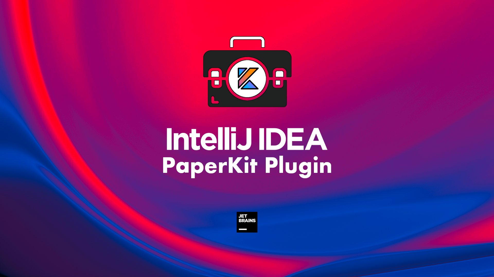
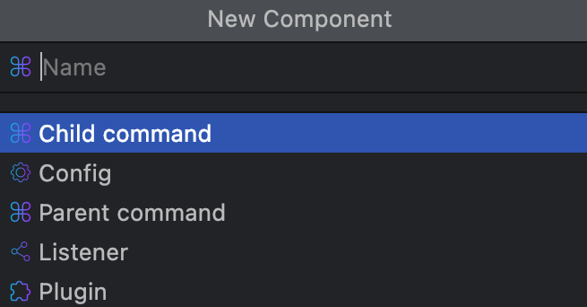

# Intellij Idea plugin for [PaperKit](https://github.com/paper-kit/paper-kit) framework

This plugin helps to develop PaperKit plugins faster and easier.

## Provides

- Project generator
- Create component action (Parent, Child command; Config; Listener; Plugin;)
- Custom icons and line markers
- Special inspections related to PaperKit

## Look and feel

## How to get?

We're in process to add this plugin into JetBrains marketplace, nonetheless you're still able to build it yourself if
you wish to.